# Purpose

In order for AVD to function, it needs the "Domain Services" object store part of Active Directory.  At present Azure Active Directory does not provide this.  So we need a solution that does.  There are two options:

1. Azure Active Directory Domain Services - [more info here](https://learn.microsoft.com/en-us/azure/active-directory-domain-services/overview).
1. Active Directory Domain Services - A virtual machine running Windows Server and AD DS

In both cases Azure Active Directory (AAD) is still used for user authentication and AAD synchronisation is needed to AADDS (automatically) and ADDS (via ADConnect)

## Which one do I choose?

### AADDS

Azure Active Directory Domain Services is the Azure provided PaaS service that replicatates the functionality of the Active Directory Domain Services by providing computer objects, group policy objects and DNS.  It is highly available and fully integrates into Azure and is the best option if you do not already have an AD implemetation (green field) or are not worried about having Azure computer objects, GPOs etc. synchronised with OnPrem.

It does have some limitations:

1. you can only have one domain
1. at time of writing it is region locked, though there is now a public preview permitting region replication
1. you cannot transfer objects to another AADDS or ADDS
1. trusts are supported but have some limitations
1. you need a virtual machine with ADDS RSAT tools to manage GPO/DNS/Computer objects etc. (but it only needs to be turned on when required)
1. you cannot import ADMX or ADML files directly - there is no central store - but you can till use them on the virtual machine you use to manage the AADDS.

This is the easiest solution to set up for AVD and the one that is recommended and it fully integrates with AAD with full synchronisation between AAD and AADDS.  Unlike normal Active Directory (using AD Connect) which can only sync one way from AD to AAD, AADDS syncs from AAD.

### ADDS

A virtual Machine based Active Directory Domain Services server is also a valid option, however as IaaS it is up to you to manage the backups, redundancy, patching etc.

This is a good option if you already have an AD infrastrcture in place and want to keep that in sync with your on prem services and use all the tools/management that you already have in place.  It is also the only option if you do not want to use or cannot use AADDS.

Using an IaaS solution does have some other limitations:
1. Integration required ADConnect to be set up
1. Connecting with Azure Storage file shares can be a pain
1. You need to maintain and keep operational the machines running ADDS at all times (but you can also use an availability set).
1. You CANNOT sync users from AAD to ADDS - i.e. you cannot create a user in AAD and have it appear in your AD virtual machine.  It is one way only from AD to AAD

# Build the AD server

# Configure the AD server

While the majority of the build is automated there is a set of steps that has to be handled manually 0 namely to connect AAD and the virtual machine based AD server together.  there are two ways tot do this:

1. AD Connect (the traditional fat client that run on a virtual or physical machine and syncs the local AD up to AAD)
1. AD Connect Cloud Sync (the new thin client/agent that runs on the AD server with all the conf and heavy lifting done in AAD)

So which one you ask?  Well AD Connect Cloud Sync is the way things are going but it does have some limitations when compared to AD Connect.  You can have a look at this [here]](https://learn.microsoft.com/en-us/azure/active-directory/cloud-sync/what-is-cloud-sync#comparison-between-azure-ad-connect-and-cloud-sync)

If you can, and it works for you, I would recommend using AD Connect Cloud Sync.  But I will cover both in this readme.

**WARNING** - AD connect my its nature connects the local AD server to AAD and writes content into your AAD.  When trying this out it would be better to set up a free Azure account with a clean tenant to see what it will do.  That way you will not interfere with any existing services.

Of course, if you already have a VM based AD server in Azure or have deployed AADDS, then you are more than welcome to use that.  Just skip this set, and ensure that the configuration, install scripts and bicep files for the AVD deployments correctly reflect your environment.

## Option 1: Set up AD Connect (traditional)

*Note: While it can be done, typically you would NOT install ADConnect on a Domain Controller, but on a separate machine.  For this build though, we will deploy on the domain controller*

Requirements:

1. The ADConnect Software - [Download link](https://www.microsoft.com/en-us/download/details.aspx?id=47594)
2. Global Admin or Hybrid Identity Admin on the AAD

First, log into the ADDS virtual machine as the Domain Admin and download the ADConnect Software then Run it.

You should get the welcome screen

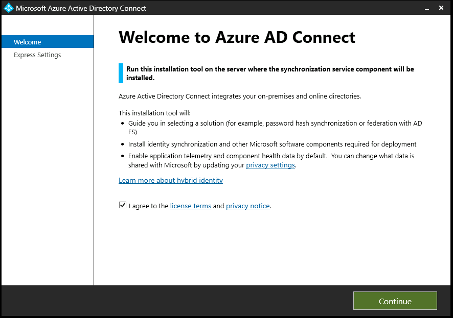

On the Express Settings page, we are going to chose **Customize**.  You can use Express settings if you wish though I would recommend only doing that in a tenant where are are not doing anything production related.

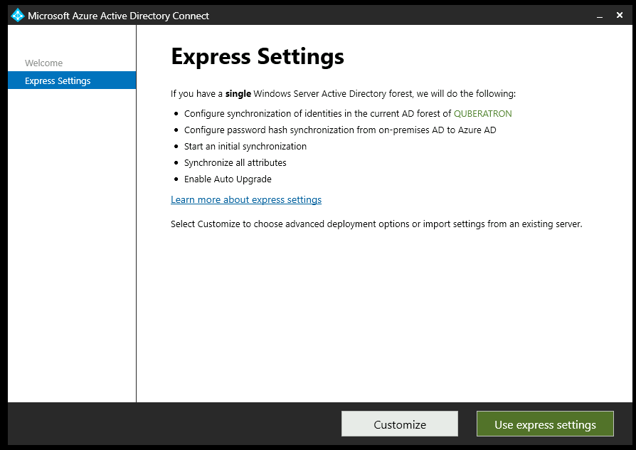

On the "Install required components" page we can leave everything as unticked.  Again you are welcome to modify this to your requirements.  An especially useful one might be the "Specify custom sync groups"

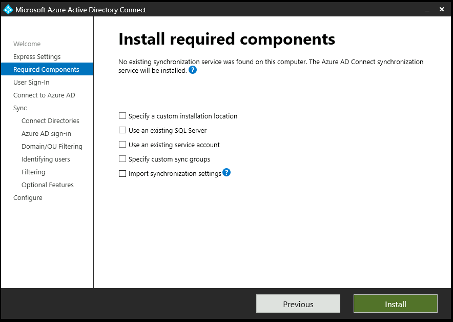

Once the "Install required components" have finished installing you will be taken to the User Sign-In page.  On this screen we need to select the type of Sign On method we want to use and whether or not we want to enable Single Sign-on.  The method is up to you depending on your environment, but for this example I have selected "Password Hash Synchronisation" which syncs the passwords between AAD and the AD server and also "Enable Single sign-on"

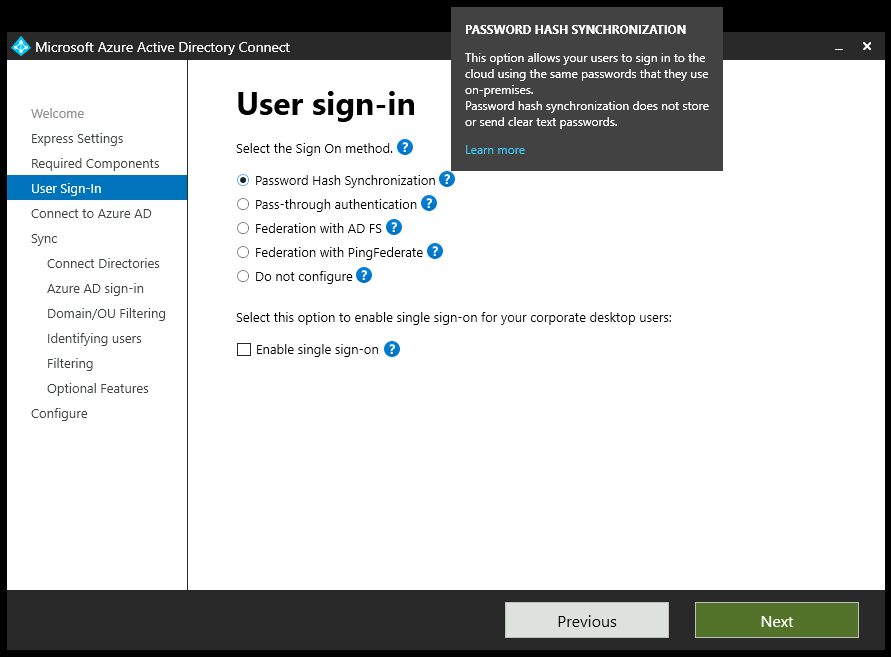

Now you need to enter the fully qualified username and password for Global Admin (or Hybrid Identity Admin).  Traditionally it was a GA account, but it is recommended to always use an account of least privilege, so would recommend setting up an account for the Hybrid Identity Admin or adding it as a Privileged Identity Management role to an existing account (required an AD P2 license).

Before you confirm the credentials, you may want to turn off the "IE Enhanced Security Configuration" in Server Manager->Local Server as is will interfere any login and multi factor authentication used with your GA or HIA account (you are using multi-factor aren't you?)

Once you have successfully logged in, you will be presented with a screen to "Connect your directories".  What you see here will be specific to you.  You will need to click "Add Directory" then provide some credentials for an appropriately permissioned account that can be used for the sync.  It is recommend that you set up a New AD Account unless you already have an account for this purpose.  Either way you will need to provide your ADDS virtuam machine domain/enterprise admin credentials.

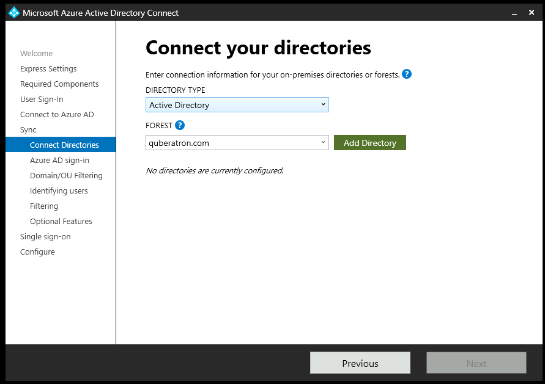

Once you have set up your connection and clicked Next we will start getting into the nitty-gritty of the synchronisation.  First up is the AD sign-in configuration where you get to choose the UPN.  It is recommended that you jsut leave it as "userPrincipalName"

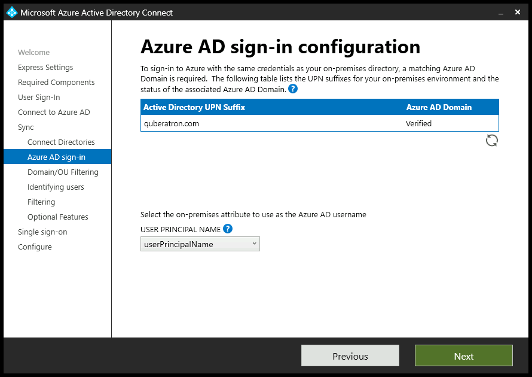

Configure any domain filtering.  You can go your own way here, but for the purposes of this demo, we will synchronise only the Users.  Below, we will be limiting this to a specific AD group which will start empty so even though we have selected users now, nothing will change in your AAD except the creation of the synchronisation account.

*Note: Just remember that any users you need to access the AVD will need to be created on the AD virtual machine and added to the group that will sync up to AAD.*

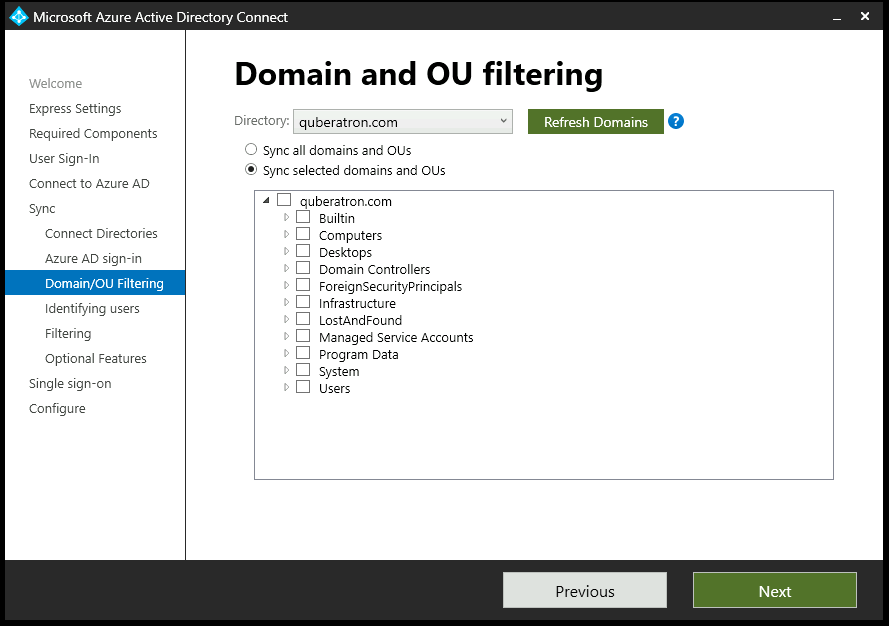

Unless you have multiple domains, you should generally select the settings as shown below for Uniquely identifying your users.

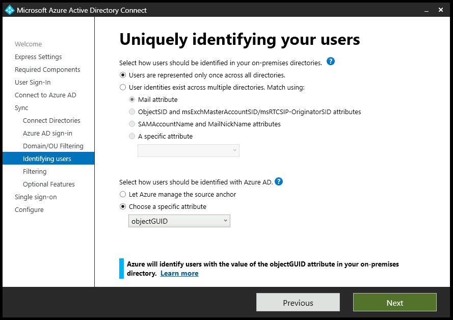

Filtering which users to sync can be very useful, however for the purposes of the demo we need to step into the virtual machine AD Users and Computers and create an empty Organisation Unit (OU).  This will ensure that no users are created on the AAD that we do not what to be created.  Suggest creating a AD virtual machine OU called "AADUserSync" or something similar.

Once done, select "Synchronize selected" then enter the name of your group and click "Resolve"

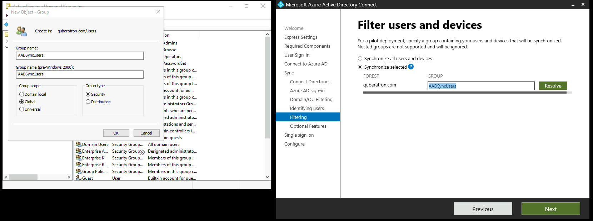

As we are wanting to have users that change their passwords in AAD "write back" those passwords to the virtual machine AD server so we can use them for logon, we need to tick the boxes for "Password writeback" in the Optional Features window

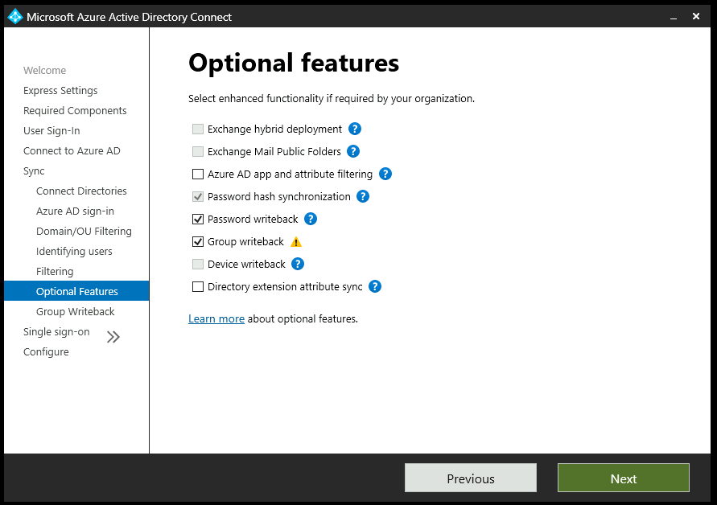

We are now in the last stage of the configuration.  To enable Single Signon you just need to enter your virtual machine AD server domain credentials.

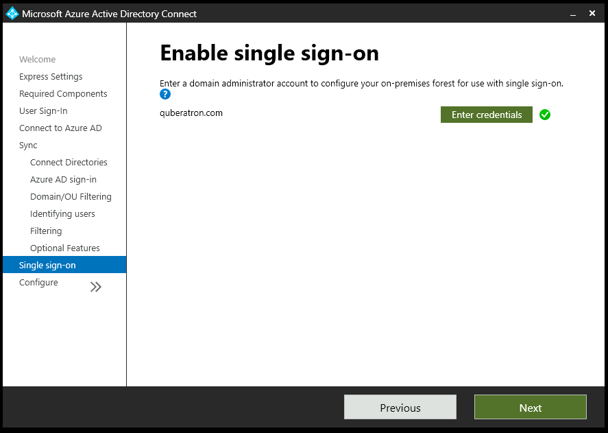

Now it will check your configuration then, on clicking "Install" will set up and configuration the synchronisation.

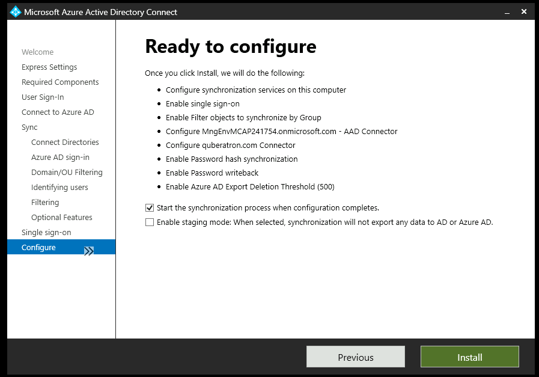

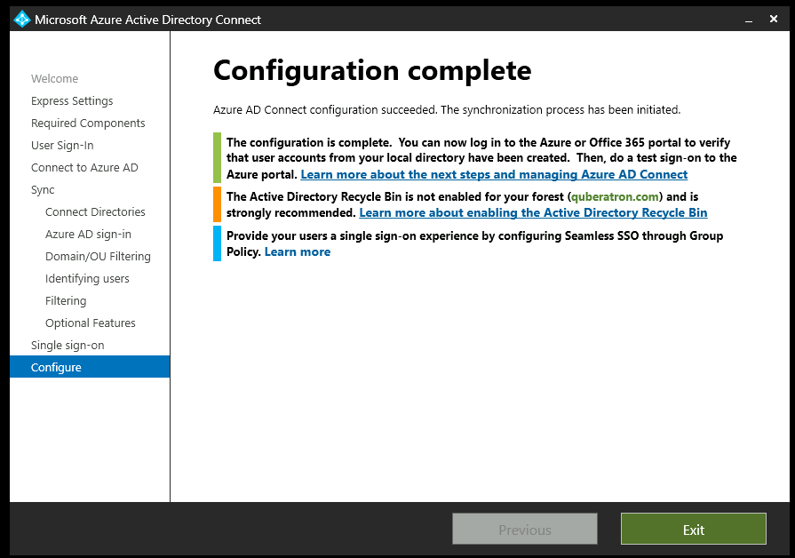

If it fails, make sure you check the logs.  9 times out of 10 it will be to do with multifactor authentication.  The service account used for sync will need to be exempted.  If it is the MFA, once the syn account has been exempted, just retry and it should succeed.

## Option 2: Set up AD Connect Cloud Sync

*Note: While it can be done, typically you would NOT install ADConnect Cloud Sync Agent on a Domain Controller, but on a separate machine.  For this build though, we will deploy on the domain controller*

The installation of the ADC Cloud Sync agent is very straight forward.  Start by logging onto the AD virtual machine we set up earlier (or the machine which you are going to sync from), open a browser and log into the Azure Portal with a sufficiently privileged account.

1. Go to Azure Active Directory -> Azure AD Connect -> Manage Azure AD cloud sync
1. Select "Download agent"
1. Accept the Terms and conditions

The download will start.

For the installation, I defer to [Microsoft's own documentation](https://learn.microsoft.com/en-us/azure/active-directory/cloud-sync/tutorial-single-forest) on this as it covers everything we would do.

Couple of points though:

1. Best practice dictates that you should use an account of least privilege (or one with a temporary elevated privilege).  For the set up of the agent it is recommended you use Hybrid Identity Admin though you can, of course, also use Global Admin.
1. Create a dedicated Organisation Unit (OU) in your virtual machine based AD called something like AADUserSync.  Do not add any users to it yet.
1. Under Scope, select the Organisational Units setting and enter the OU path of the AADUserSync

Once you do this try and provision a user.  It should fail as there is nothing in the AADUserSync OU.

Assuming this all works as planned, carry on to the next section on testing.

## Testing the Sync

First check that no existing users have been created in Azure Active Directory.  No user, unless that user is in the AADUserSync OU should have appeared in AAD.

Create a new user in the local virtual machine AD and try and sync either through AD Connect or AD Connect Cloud Sync (or wait until the sync happens).  Check on AAD - nothing should have been created, and in the virtual machine AD AD Connect manager, you should see that synchronisation was successful.

Now move that user on the local AD server to the AADUSerSync OU and restart the sync process.  The new user should have been successfully created in AAD and you should be able to sign into both AAD and AVD with it.

# Configure Password Writeback (ADDS only)

Password writeback allows a user to change their password in Azure Active Directory and that change is then reflected in their "on-prem", or in this case the virtual machine that is running the ADDS server.  This adds the final connection between AD Connect / AD Connect Cloud Sync and AAD.  To enable it:

1. Sign in to the Azure portal using a Hybrid Identity Administrator account.
1. Search for and select Azure Active Directory, select Password reset, then choose On-premises integration.
1. Check the option for Write back passwords to your on-premises directory
1. OR Check the option for Write back passwords with Azure AD Connect cloud sync.
1. Check the option for Allow users to unlock accounts without resetting their password to Yes (optional)

You should now be able to change/reset a password in AAD and that password be reflected in ADDS.